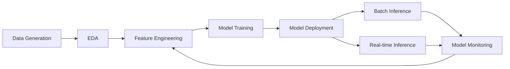

# Next Best Product Recommendation - MLOps Pipeline
## Home Credit Hyper-Personalization POC

[](https://databricks.com)
[](https://python.org)
[](https://mlflow.org)

---

## 📋 Overview

This project demonstrates an **end-to-end MLOps pipeline** for building a Next Best Product Recommendation system using Databricks. It showcases:

- ✅ Complete ML lifecycle from data generation to model monitoring
- ✅ Modular, reusable code architecture
- ✅ Databricks Feature Store integration
- ✅ MLflow experiment tracking and model registry
- ✅ Unity Catalog for data and model governance
- ✅ Both batch and real-time inference capabilities
- ✅ Model monitoring and drift detection
- ✅ Local and Databricks execution modes

---

## 🎯 Business Use Case

**Problem**: Recommend the next best banking product to each customer based on their profile, transaction history, and behavioral patterns.

**Solution**: Multi-class classification model that predicts which product (Personal Loan, Home Loan, Credit Card, etc.) a customer is most likely to purchase next.

**Business Impact**:
- Increased cross-sell success rates
- Personalized customer experience
- Optimized marketing campaigns
- Revenue growth through targeted recommendations

---

## 🏗️ Project Structure

```
home-credit-hyperpersonalization-poc/
│
├── config/
│   └── config.yaml                    # Central configuration file
│
├── utils/                             # Reusable utility modules
│   ├── common_utils.py               # Common helper functions
│   ├── data_loader.py                # Data loading/saving utilities
│   ├── feature_engineering.py        # Feature creation functions
│   ├── model_training.py             # Model training utilities
│   ├── model_deployment.py           # Deployment utilities
│   ├── model_monitoring.py           # Monitoring utilities
│   └── eda_utils.py                  # EDA helper functions
│
├── notebooks/                         # Databricks notebooks
│   ├── 00_data_generation.ipynb        # Generate synthetic data
│   ├── 01_eda.ipynb                    # Exploratory Data Analysis
│   ├── 02_feature_engineering.ipynb    # Feature creation
│   ├── 03_model_training.ipynb         # Model training & MLflow
│   ├── 04a_model_registration.ipynb    # Register model to Unity Catalog
│   ├── 04b_set_model_alias_to_staging.ipynb    # Set model alias to staging
│   ├── 04c_set_model_alias_to_production.ipynb # Set model alias to production
│   ├── 04d_model_deployment.ipynb      # Deploy model endpoint
│   ├── 05_model_monitoring.ipynb       # Model monitoring
│   ├── 06_Batch_inference.ipynb        # Batch predictions
│   ├── 07_local_realtime_inference.ipynb      # Local real-time inference
│   └── 07_databricks_realtime_inference.ipynb # Databricks real-time inference
│
├── data/                              # Data directories (created at runtime)
│   ├── raw/                          # Raw CSV files (generated)
│   └── processed/                    # Processed data (generated)
│
├── outputs/                           # Output directories
│   ├── eda/                          # EDA results
│   ├── models/                       # Model artifacts
│   ├── monitoring/                   # Monitoring reports
│   └── predictions/                  # Prediction outputs
│
├── requirements.txt                   # Python dependencies
├── README.md                          # This file
├── SETUP.md                          # Detailed setup instructions
├── QUICKSTART.md                     # Quick start guide
├── PROJECT_SUMMARY.md                # Executive summary
├── PROJECT_GUIDE.md                  # Complete project guide
├── ER_diagram.txt                    # Database schema
└── Table_DDL.txt                     # SQL DDL statements

```

---

## 🚀 Quick Start

### Prerequisites

- **Databricks Workspace** (for production) OR **Local Python environment** (for development)
- Python 3.8+
- Access to Unity Catalog (optional, can use CSV mode)

### Step 1: Clone Repository

```bash
git clone <repository-url>
cd home-credit-hyperpersonalization-poc
```

### Step 2: Install Dependencies

```bash
pip install -r requirements.txt
```

### Step 3: Configure Settings

Edit `config/config.yaml`:

```yaml
# For local development
environment:
  mode: "local"  # Change to "databricks" for production

data_source:
  type: "csv"  # Change to "unity_catalog" for Databricks
```

### Step 4: Run the Pipeline

**Note**: The notebooks are Jupyter notebooks (.ipynb). You can run them using Jupyter or in Databricks.

```bash
# Generate synthetic data
jupyter notebook notebooks/00_data_generation.ipynb

# Run EDA
jupyter notebook notebooks/01_eda.ipynb

# Create features
jupyter notebook notebooks/02_feature_engineering.ipynb

# Train model
jupyter notebook notebooks/03_model_training.ipynb

# Register and deploy model (run in sequence)
jupyter notebook notebooks/04a_model_registration.ipynb
jupyter notebook notebooks/04b_set_model_alias_to_staging.ipynb
jupyter notebook notebooks/04c_set_model_alias_to_production.ipynb
jupyter notebook notebooks/04d_model_deployment.ipynb

# Monitor model
jupyter notebook notebooks/05_model_monitoring.ipynb

# Run batch inference
jupyter notebook notebooks/06_Batch_inference.ipynb

# Test real-time inference (choose based on your mode)
jupyter notebook notebooks/07_local_realtime_inference.ipynb
# OR
jupyter notebook notebooks/07_databricks_realtime_inference.ipynb
```

---

## 📊 Key Features

### 1. **Configurable Execution Mode**

Switch between local and Databricks environments using a single config file:

```yaml
environment:
  mode: "local"  # or "databricks"

data_source:
  type: "csv"  # or "unity_catalog"
```

### 2. **Feature Store Integration**

Automatically registers features to Databricks Feature Store:

```python
# Features are saved to Feature Store in feature engineering notebook
fs_client.create_table(
    name="customer_product_features",
    primary_keys=["CUSTOMERID"],
    df=features_df
)
```

### 3. **MLflow Experiment Tracking**

All experiments are tracked with comprehensive logging:

- Hyperparameters
- Metrics (accuracy, precision, recall, F1)
- Feature importance
- Model artifacts
- Custom tags for organization

### 4. **Model Registry & Deployment**

Models are registered to Unity Catalog Model Registry:

```python
# Register model
model_version = mlflow.register_model(model_uri, registered_model_name)

# Transition to production
client.transition_model_version_stage(name, version, "Production")
```

### 5. **Dual Inference Modes**

- **Batch**: Score all customers on schedule
- **Real-time**: REST API endpoint for instant predictions

### 6. **Comprehensive Monitoring**

- Feature drift detection (Kolmogorov-Smirnov test)
- Data quality metrics
- Model performance comparison
- Prediction distribution analysis

---

## 📈 Pipeline Workflow



---

## 🔧 Configuration Guide

### Data Source Configuration

**Local Mode (CSV)**:
```yaml
data_source:
  type: "csv"
  csv:
    input_path: "./data/raw"         # Created when notebooks run
    output_path: "./data/processed"  # Created when notebooks run
```

**Databricks Mode (Unity Catalog)**:
```yaml
data_source:
  type: "unity_catalog"
  unity_catalog:
    catalog: "home_credit_catalog"
    schema: "banking_data"
```

### MLflow Configuration

**Local**:
```yaml
mlflow:
  local:
    tracking_uri: "./mlruns"  # Created at project root when training runs
    experiment_name: "next_best_product_local"
```

**Databricks**:
```yaml
mlflow:
  databricks:
    tracking_uri: "databricks"
    experiment_name: "/Users/your-email@company.com/next-best-product"
    model_registry_uri: "databricks-uc"
```

---

## 📦 Outputs

### EDA Outputs (`outputs/eda/`)
- Data summary CSV
- Missing value analysis CSV
- Numeric statistics CSV
- Correlation matrices CSV
- Target distribution CSV
- EDA summary text file

### Model Outputs (`outputs/models/`)
- Feature importance CSV and PNG
- Model artifacts (when saved locally)

### Monitoring Outputs (`outputs/monitoring/`)
- Drift detection reports (HTML)
- Data quality metrics (JSON, CSV)
- Performance comparison (HTML, CSV)
- Monitoring dashboards

### Prediction Outputs (`outputs/predictions/`)
- Batch prediction results
- Recommendation outputs

### MLflow Outputs
- Experiment runs in `./mlruns/` (local mode)
- Registered models in Unity Catalog (Databricks mode)

---

## 🔍 Model Details

### Algorithm
- **Primary**: Random Forest Classifier
- **Alternative**: Logistic Regression (configurable)

### Features Created
1. **Demographic**: Age, tenure, location
2. **Account**: Number of accounts, principal amounts, interest rates
3. **Transaction**: Frequency, recency, amount patterns
4. **Communication**: Engagement frequency, channel preferences
5. **Behavioral**: Product diversity, account status patterns

### Target Variable
- **Next Product Purchased**: Product ID of next banking product purchased within 90-day window

### Evaluation Metrics
- Accuracy
- Precision (weighted)
- Recall (weighted)
- F1 Score (weighted)
- ROC AUC (one-vs-rest)

---

## 🎓 Learning Resources

This project demonstrates:

1. **Databricks Feature Store**: Centralized feature management
2. **MLflow**: Experiment tracking and model registry
3. **Unity Catalog**: Data and model governance
4. **Model Serving**: Real-time and batch inference
5. **Monitoring**: Drift detection and quality metrics
6. **MLOps Best Practices**: Modular code, configuration management

---

## 📞 Support & Contribution

For questions or contributions:
1. Create an issue in the repository
2. Submit a pull request with improvements
3. Contact the Data Science team

---

## 📝 License

This project is for demonstration purposes. Modify as needed for your use case.

---

## ✅ Next Steps

1. **Review EDA outputs** to understand the data
2. **Experiment with hyperparameters** in `config.yaml`
3. **Add custom features** in `utils/feature_engineering.py`
4. **Deploy to production** on Databricks
5. **Set up monitoring alerts** for model drift
6. **Integrate with business systems** via REST API

---
